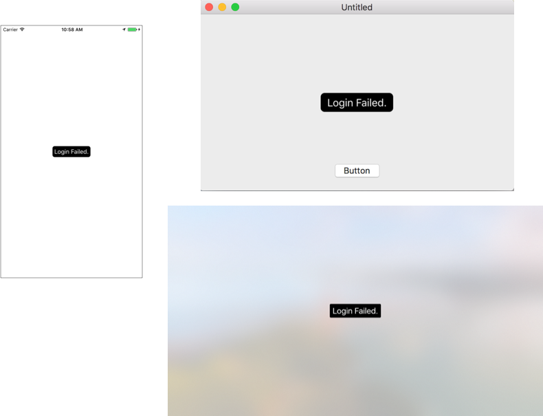

Toast
---
Yet another Toast library🍞   
Inspired by [Toast-Swift](https://github.com/scalessec/Toast-Swift), but this one supports multiplatform. That means you can popup Toasts on iOS, tvOS, macOS(OSX), everywhere!

It has yet very limited functionalities yet, so PRs or suggestions are very welcomed!

# Screenshots


# Requirements
- Swift 3.0
- iOS 8.0+
- tvOS 9.0+
- macOS 10.11+

# Install
## Carthage
```
github "toshi0383/Toast"
```
